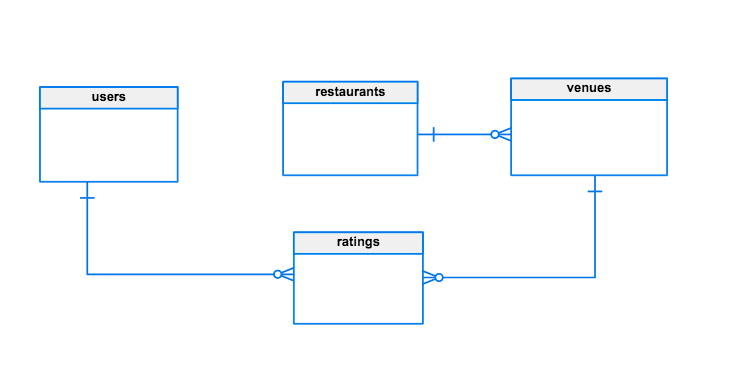

# RESTful Restaurant Review API
### Goal
A restaurant review software startup provides rating services to consumers. The company
needs a RESTful API service to create and query rating info of restaurants. Your task is to
design and implement the API service.

A restaurant category can be Mexican, Burger, French, Thai, Chinese, Japanese, etc. A
restaurant may have multiple locations (addresses). A user can only give a rating to a
restaurant per location.

Cost, Food, Cleanliness, and Service are required rating criteria with min/max values from
1 to 5 (star) for user to rate the restaurant; the rating must comply with the range
constraint. The API will calculate the total score by averaging these criteria. A user can give
a rating to the same restaurant no more than **once a month**. If the total score is 1, the user
must provide a comment. The API should return an appropriate error message and error
code if the validation failed.

### Contents

1. Software Stack
2. API/Method mapping table
3. Endpoints
4. Database schema
5. Code distribution
6. Running
7. Constraints
8. Future features

----

### Software Stack

The software stack of this web-service can be broken down as follows:

* Backend : GOlang (v1.8)
* Database : Postgres DB
* Frontend^ : Javascript, HTML5, CSS3

(_Frontend not implemented in this release_)^

For demo/testing use [api-demo.py](https://github.com/Skrelan/rest-restaurant/blob/master/local/api-demo.py)(_optional_) : Python 2.7

------

### API/Method mapping table

|   | /user  | /restaurant   | /ratings      |
|---|---     |---            |---            |
|**GET**| `/users`<br> `/users?id=1,2` <br> `/users/{id}` | `/restaurants` <br> `/restaurants?id=1,2`<br> `/restaurants?name=dosa&city=San%20Jose` <br> `/restaurants/{id}`  | `/ratings` <br> `/ratings?user_id=1` <br> `/ratings?restaurant_id=1` <br> `/ratings?restaurant_id=1&user_id=2` <br> `/ratings/{id}` <br>|
|**POST**   | `/users`   | `/restaurants`  | `/ratings`   |
|**PUT**   | `/users?id=1` <br> `/users/{id}`   | `/restaurant?id=1` <br> `/restaurant/{id}` <br> `/restaurant?id=1&update_parent=true` <br> `/restaurant/{id}?update_parent=true` | `/ratings?id=1` <br> `/ratings/{id}` <br> `/ratings/user_id=1&restaurant_id=2`   |  
|**DELETE**   | None  |  None  | None  |


----

### Endpoints
#### /v1
**NOTE** : ALL endpoints that accept id as a parameter can be accessed as either `v1/entity/{id}` or `v1/entity?id={id}`. This is done to make integrating and developing new features in the front-end; that require to access the APIs, easier.

| Endpoint | Method | Parameters | Input | Output | Description |
| -------- | -------| ---------- | ------------| ----| ---- |
| `/v1/users` | | | | | |
| |  GET     | `None` : can be called with no parameter  <br> <br> `id` : can be called by user id(s)        |   None |  JSON; Array of [models.User](https://github.com/Skrelan/rest-restaurant/blob/master/models/models.go#L12) | Get user(s) info |
| | POST | `None` : can be called with no parameter | JSON; [models.User](https://github.com/Skrelan/rest-restaurant/blob/master/models/models.go#L12) | JSON; status message | Create a user|
| | PUT |  `id` : id of user to be updated | JSON; [models.User](https://github.com/Skrelan/rest-restaurant/blob/master/models/models.go#L12) | JSON; status message | Update a user <br> <br> id required |
| `/v1/restaurants` | | | | | |
| | GET | `None` : can be called with no parameter <br><br> `id` : can be called by restaurant by id(s) <br><br> `zip_code` : can be called by 5 digit zip_code(s) <br><br> `name` : can be called by name(s) <br><br> `category` : can be called by category <br><br> `city` : can be called by city <br><br> `total_score` : can be called total_score | None | JSON; array of [models.Restaurant](https://github.com/Skrelan/rest-restaurant/blob/master/models/models.go#L20) | Get restaurant(s) by name/city/category/total score |
| | POST | `None` : can be called with no parameter | JSON; [models.Restaurant](https://github.com/Skrelan/rest-restaurant/blob/master/models/models.go#L20) | JSON; status message | Create a restaurant |
| | PUT | `id` : can be called by restaurant by id(s). <br><br> `update_parent` : boolean, if enabled, changing the restaurant name/category will impact all other venues as well | JSON; [models.Restaurant](https://github.com/Skrelan/rest-restaurant/blob/master/models/models.go#L20) | JSON; status message | Update a restaurant(s) <br> <br> id required <br><br> **NOTE** : changing the name of the restaurant will only impact this venue with given id, if `update_parent` is NOT set to true|
| `/v1/ratings` | | | | | |
|| GET| `None` : can be called with no parameter <br><br> `id` : can be called by rating id(s) <br><br> `user_id` : can be called by user id(s) <br><br> `restaurant_id` : can be called by restaurant id(s) | None | JSON; array of type [models.UserRestaurantRating](https://github.com/Skrelan/rest-restaurant/blob/master/models/models.go#L42) | Get ratings |
| | POST| `None` : can be called with no parameter | JSON; [models.Rating](https://github.com/Skrelan/rest-restaurant/blob/master/models/models.go#L28) | JSON; status message | Create a rating for a restaurant venue by a user <br><br> **NOTE:** user can only give a venue of a restaurant a review, if the user: <br> 1. has not given rating to a different venue of the same restaurant in the past 30 days <br> 2. has not already given a review to the same venue.|
| | PUT | `id` : can be called by rating id <br><br> `restaurant_id`: id of the restaurant venue <br><br>`user_id`: id of the user | JSON; [models.Rating](https://github.com/Skrelan/rest-restaurant/blob/develop/models/models.go#L28) | JSON; status message | Update a rating for a restaurant by a user <br><br> id required <br>OR<br> both restaurant_id & user_id required |


-----

### Database Schema:
The DB has 4 tables, they are as follows:
1. `users`
2. `restaurants`
3. `venues`
4. `ratings`
The DB has 1 view
1. `aggregated_venue_score`

#### Tables:
##### 1.users
|col_name   |type   |  
|---|---|
|id   | SERIAL   |   
|first_name   |  VARCHAR(50) |  
|last_name   |   VARCHAR(50)|   
|phone   | VARCHAR(10)  |    

constraints:
* ` UNIQUE (first_name, last_name, phone)`


##### 2. restaurant
|col_name   |type   |  
|---|---|
|id   | SERIAL   |   
|name   |  VARCHAR(50) |  
|category   |   VARCHAR(50)|   

constraints:
* ` UNIQUE (name, category)`

##### 3. venues
|col_name   |type   |  
|---|---|
|id   | SERIAL   |   
|restaurant_id   |   INT|
|street_address   |  VARCHAR(95) |  
|city   |   VARCHAR(40)|  
|state   |   VARCHAR(4)|
|zip_code   |   VARCHAR(5)|

constraints:
* ` UNIQUE (street_address, city, state, restaurant_id)`
* ` foreign key (restaurant_id)
 REFERENCES restaurants (id)`

##### 4. ratings

|col_name   |type   |  
|---|---|
|id   | SERIAL   |   
|cost   |  SMALLINT |  
|food   |  SMALLINT |   
|cleanliness  |  SMALLINT |  
|service  |  SMALLINT |
|total_score   |   NUMERIC(5,2) |
| venue_id     |   INT          |
| user_id      |   INT          |
| comments     |   VARCHAR(400) |
| date_time_created | TIMESTAMP |
| date_time_updated | TIMESTAMP |


constraints:
* ` UNIQUE ( user_id, venue_id )`
* ` foreign key (venue_id)
  REFERENCES venues (id)`
* ` foreign key (user_id)
 REFERENCES users (id)`

### Views

##### aggregated_venue_score

|col_name   | value   |  
|---|---|
|venue_id   | venues.id   |   
|score   |  AVG(rate.total_score)) |  

```
CREATE OR REPLACE VIEW aggregated_venue_score AS
SELECT
    v.id as "venue_id",
    AVG(rate.total_score) as "score"
FROM ratings as rate
INNER JOIN venues AS v
ON rate.venue_id = v.id
GROUP by v.id;
```

##### DB Diagram :



 ------

### Code distribution
 The RESTful web-service is written GOlang and each independent chunk of code is bundled up into it's own individual package. The following packages exist in the code in this repository:

 * **db pkg** : This package contains the code for all the DB related functions, such as reading DB configs, setting up a DB connection, functions that are used to Query the DB, etc.

 * **middleware pkg** : This package contains all the code acts as the connective glue between the exposed endpoints and other packages involved

 * **models pkg** : This package contains all the models defined for the business logic of the web-application.

 * **utils pkg** : This package contains all the utility functions that help with making the code more maintainable. Functions that this package houses are ValidateNewUser, ValidateNewRestaurant, GenerateError, ResponseCodes etc.

 Other packages used are as follows:
 * [sqlx](http://jmoiron.github.io/sqlx/)
 * [logrusWrapper](https://github.com/Skrelan/LogrusWrapper)
 * [mux](http://www.gorillatoolkit.org/pkg/mux)
 * [net/http](https://golang.org/pkg/net/http/)
 * [encoding/json](https://golang.org/pkg/encoding/json/)
 * [fmt](https://golang.org/pkg/fmt/)
 * [strings](https://golang.org/pkg/strings/)
 * [testify](https://github.com/stretchr/testify)
 * [testing](https://golang.org/pkg/testing)

 ----

### Running

1. Set up a Postgres DB locally and run the [migrations](https://github.com/Skrelan/rest-restaurant/tree/master/db/migration)

2. Set up `db/config.json` as shown:
  ```
  {
    "host" : "localhost",
    "db_type" : "postgres",
    "db_name" : "rest_restaurants",
    "user" : "", //your user name
    "token" : "", //your user token
    "ssl_mode" : "disable"
  }
  ```

3. Make sure you have all the required packages installed and have GO 1.8 set up locally. Install the below package in your go root by either manually moving it there or by running `go get github.com/skrelan/rest-restaurant` _(it might fail as this repo is private)_

  Also make sure the following files exist, w.r.t project root.
  * `db/config.json`
  * `rest-restaurant`^

  ^_optional_
  <br>

4. To run the application go to the project root and either run:
    * Option 1
    ```
    $ go build
    $ ./rest-restaurant
    ```
    * Option 2
    ```
    $ go run main.go
    ```
    * By default the application should listen to `localhost:8000` and all the API endpoints can be called on that.

5. To test the API's there are two ways as well:
    1. manually make requests to each endpoint.
    2. use the python script, that I wrote to automate option 1.

    To run the python script, run the following:
      ```
      $ cd local
      $ python run api-demo.py
    ```

----
### Constraints

The following constraints exist:
- DELETE endpoint has not been enabled

-----
### Future features for next release(s)

- Better Testing (unit tests and integration test) coverage
- Front-end development for User Rating feed
- More validation checks on endpoints
- Manage environment settings via config files
- Enabling DELETE endpoint
