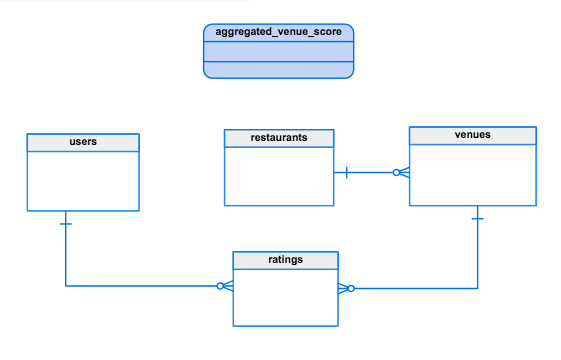

# RESTful Restaurant Review API
### Goal
A restaurant review software startup provides rating services to consumers. The company
needs a RESTful API service to create and query rating info of restaurants. Your task is to
design and implement the API service.

A restaurant category can be Mexican, Burger, French, Thai, Chinese, Japanese, etc. A
restaurant may have multiple locations (addresses). A user can only give a rating to a
restaurant per location.

Cost, Food, Cleanliness, and Service are required rating criteria with min/max values from
1 to 5 (star) for user to rate the restaurant; the rating must comply with the range
constraint. The API will calculate the total score by averaging these criteria. A user can give
a rating to the same restaurant no more than **once a month**. If the total score is 1, the user
must provide a comment. The API should return an appropriate error message and error
code if the validation failed.

### Contents

1. Software Stack
2. API/Method mapping table
3. Endpoints
4. Database schema
5. Code distribution
6. Running
7. Constraints

----

### Software Stack

The software stack of this web-service can be broken down as follows:

* Backend : GOlang (v1.8)
* Database : Postgres DB
* Frontend : Javascript, HTML5, CSS3

------

### API/Method mapping table

|   | /user  | /restaurant   | /ratings      |
|---|---     |---            |---            |
|**GET**| `/users`<br> `/users?id=1,2` <br> `/users/{id}` | `/restaurants` <br> `/restaurants?id=1,2`<br> `/restaurants?name=dosa&city=San%20Jose` <br> `/restaurants/{id}`  | `/ratings` <br> `/ratings?user_id=1` <br> `/ratings?restaurant_id=1` <br> `/ratings?restaurant_id=1&user_id=2` <br> `/ratings/{id}` <br>|
|**POST**   | `/users`   | `/restaurants`  | `/ratings`   |
|**PUT**   | `/users?id=1` <br> `/users/{id}`   | `/restaurant?id=1` <br> `/restaurant/{id}` <br> `/restaurant?id=1&update_parent=true` <br> `/restaurant/{id}?update_parent=true` | `/ratings?id=1` <br> `/ratings/{id}` <br> `/ratings/user_id=1&restaurant_id=2`   |  
|**DELETE**   | None  |  None  | None  |


----

### Endpoints
#### /v1
**NOTE** : ALL endpoints that accept id as a parameter can be accessed as either `v1/entity/{id}` or `v1/entity?id={id}`. This is done to make integrating and developing new features in the front-end; that require to access the APIs, easier.

* `/users`:
  * Description : Get user(s) info
    * Method Type: `GET`
    * Parameters :
      * `None` : can be called with no parameter
      * `id` : can be called by user id(s)
    * Input : None
    * Output : JSON; Array of [models.User](https://github.com/Skrelan/rest-restaurant/blob/develop/models/models.go#L12)

  * Description : Update a user
    * Method Type: `PUT`
    * Parameters :
      * `id` : id of user to be updated
    * Input : JSON of type [models.User](https://github.com/Skrelan/rest-restaurant/blob/develop/models/models.go#L12)
    * Output : JSON; status message

  * Description : Create a user
    * Method Type: `POST`
    * Parameters :
      * `None` : can be called with no parameter
    * Input : JSON of type [models.User](https://github.com/Skrelan/rest-restaurant/blob/develop/models/models.go#L12)
    * Output : JSON; status message

* `/restaurants`:
  * Description : Get restaurant(s) by name / city/ category/total score
    * Method Type: `GET`
    * Parameters :
      * `None` : can be called with no parameter
      * `id` : can be called by restaurant by id(s)
      * `zip_code` : can be called by 5 digit zip_code(s)
      * `name` : can be called by name(s)
      * `category` : can be called by category
      * `city` : can be called by city
      * `total_score` : can be called total_score
    * Input : None
    * Output : JSON; array of [models.Restaurant](https://github.com/Skrelan/rest-restaurant/blob/develop/models/models.go#L20)

  * Description : Update a restaurant
    * Method Type: `PUT`
    * Parameters :
      * `id` : can be called by restaurant by id(s). **NOTE** : changing the name of the restaurant will only impact this venue with given id
      * `update_parent` : boolean, if enabled, changing the restaurant name/category will impact all other venues as well
    * Input : JSON; [models.Restaurant](https://github.com/Skrelan/rest-restaurant/blob/develop/models/models.go#L20)
    * Output : JSON; status message


  * Description : Create a restaurant
    * Method Type: `POST`
    * Parameters :
      * `None` : can be called with no parameter
    * Input : JSON; [models.Restaurant](https://github.com/Skrelan/rest-restaurant/blob/develop/models/models.go#L20)
    * Output : JSON; status message

* `/ratings`:
  * Description : Get ratings
    * Method Type: `GET`
    * Parameters :
      * `None` : can be called with no parameter
      * `id` : can be called by rating id(s)
      * `user_id` : can be called by user id(s)
      * `restaurant_id` : can be called by restaurant id(s)
    * Input : None
    * Output : JSON; array of type [models.UserRestaurantRating](https://github.com/Skrelan/rest-restaurant/blob/develop/models/models.go#L42)

  * Description : Update a rating for a restaurant by a user
    * Method Type: `PUT`
    * Parameters :
      * `id` : can be called by rating id
    * Input : JSON; [models.Rating](https://github.com/Skrelan/rest-restaurant/blob/develop/models/models.go#L28)
    * Output : JSON; status message

  * Description :  Create a rating for a restaurant by a user
    * Method Type: `POST`
    * Parameters :
      * `None` : can be called with no parameter
    * Input : JSON; [models.Rating](https://github.com/Skrelan/rest-restaurant/blob/develop/models/models.go#L28)
    * Output :  JSON; status message


-----

### Database Schema:
The DB has 4 tables, they are as follows:
1. `users`
2. `restaurants`
3. `venues`
4. `ratings`

##### 1.users
|col_name   |type   |  
|---|---|
|id   | SERIAL   |   
|first_name   |  VARCHAR(50) |  
|last_name   |   VARCHAR(50)|   
|phone   | VARCHAR(10)  |    

constraints:
* ` UNIQUE (first_name, last_name, phone)`


##### 2. restaurant
|col_name   |type   |  
|---|---|
|id   | SERIAL   |   
|name   |  VARCHAR(50) |  
|category   |   VARCHAR(50)|   

constraints:
* ` UNIQUE (name, category)`

##### 3. venues
|col_name   |type   |  
|---|---|
|id   | SERIAL   |   
|restaurant_id   |   INT|
|street_address   |  VARCHAR(95) |  
|city   |   VARCHAR(40)|  
|state   |   VARCHAR(4)|
|zip_code   |   VARCHAR(5)|

constraints:
* ` UNIQUE (street_address, city, state, restaurant_id)`
* ` foreign key (restaurant_id)
 REFERENCES restaurants (id)`

##### 4. ratings

|col_name   |type   |  
|---|---|
|id   | SERIAL   |   
|cost   |  SMALLINT |  
|food   |  SMALLINT |   
|cleanliness  |  SMALLINT |  
|service  |  SMALLINT |
|total_score   |   NUMERIC(5,2) |
| venue_id     |   INT          |
| user_id      |   INT          |
| comments     |   VARCHAR(400) |
| date_time_created | TIMESTAMP |
| date_time_updated | TIMESTAMP |


constraints:
* ` UNIQUE ( user_id, venue_id )`
* ` foreign key (venue_id)
  REFERENCES venues (id)`
* ` foreign key (user_id)
 REFERENCES users (id)`


 ------

 ### Code distribution
 The RESTful web-service is written GOlang and each independent chunk of code is bundled up into it's own individual package. The following packages exist in the code in this repository:

 * **db pkg** : This package contains the code for all the DB related functions, such as reading DB configs, setting up a DB connection, functions that are used to Query the DB, etc.

 * **middleware pkg** : This package contains all the code acts as the connective glue between the exposed endpoints and other packages involved

 * **models pkg** : This package contains all the models defined for the business logic of the web-application.

 * **utils pkg** : This package contains all the utility functions that help with making the code more maintainable. Functions that this package houses are ValidateNewUser, ValidateNewRestaurant, GenerateError, ResponseCodes etc.

 Other packages used are as follows:
 * [sqlx](http://jmoiron.github.io/sqlx/)
 * [logrusWrapper](https://github.com/Skrelan/LogrusWrapper)
 * [mux](http://www.gorillatoolkit.org/pkg/mux)
 * [net/http](https://golang.org/pkg/net/http/)
 * [encoding/json](https://golang.org/pkg/encoding/json/)
 * [fmt](https://golang.org/pkg/fmt/)
 * [strings](https://golang.org/pkg/strings/)
 * [testify](https://github.com/stretchr/testify)
 * [testing](https://golang.org/pkg/testing)

 ----

### Running
In order to run the web-service, make sure you have all the required packages installed and have GO 1.8 set up locally. Install the below package in your go root by either manually moving it there or by running `go get github.com/skrelan/rest-restaurant` _(it might fail as this repo is private)_

Also make sure the following files exist, w.r.t project root.
* `db/config.json`
* `rest-restaurant`^

^_optional_
<br>

To run the application go to the project root and either run:
* Option 1
```
$ go build
$ ./rest-restaurant
```
* Option 2
```
$ go run main.go
```

By default the application should listen to `localhost:8000` and all the API endpoints can be called on that.
